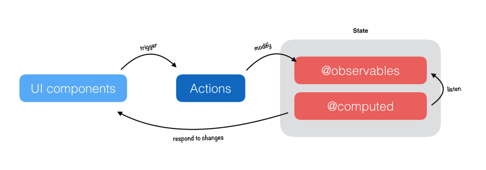

#### MobX

MobX 的实现思路非常简单直接，类似于 Vue 中的响应式的原理，其实质可以简单理解为观察者模式，数据是被观察的对象，「响应」是观察者，响应可以是计算值或者函数，当数据发生变化时，就会通知「响应」执行。借用一张网上的图（图片来源）描述下原理：

Mobx 最大的好处是简单、直接，数据发生变化，那么界面就重新渲染，在 React 中使用时，我们甚至不需要关注 React 中的 state，我们看下用 MobX 怎么解决：
```
// store.js
import { observable } from 'mobx';
const store = observable({
  sku: '',
  desc: '',
});
export default store;
// App.js
import React, { PureComponent } from 'react';
import store from './store.js';
export default class App extends PureComponent {
  componentDidMount() {
    fetch('url', { id: this.props.id })
      .then(resp => resp.json())
      .then(data => Object.assign(store, data));
  }
  render() {
    return (
      
    );
  }
}
// ProductInfoOne.js
import React, { PureComponent } from 'react';
import { action } from 'mobx';
import { observer } from 'mobx-react';
import store from './store';
@observer
class ProductInfoOne extends PureComponent {
  @action
  onEditSku = (sku) => {
    store.sku = sku;
  };
  render() {
    const { sku } = store;
    return (
      {sku}
    );
  }
}
export default ProductInfoOne;
// ProductInfoTwo.js
import React, { PureComponent } from 'react';
import { action } from 'mobx';
import { observer } from 'mobx-react';
import store from './store';
@observer
class ProductInfoTwo extends PureComponent {
  @action
  onEditDesc = (desc) => {
    store.desc = desc;
  };
  render() {
    const { desc } = store;
    return (
      {desc}
    );
  }
}
export default ProductInfoTwo;
```