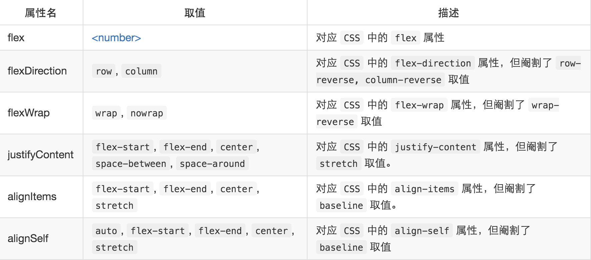

- 组件与组件之间的间隔距离 (不带单位)

```
margin: 10;
```

- 组件与内容之间的间隔距离, 默认单位是 px， Text 组件中常用

```
padding: 10;
```

- 设置组件之间，水平方向布局

```
flexDirection: 'row',
```

- 设置组件之间，竖直方向布局, react-native 默认是这种布局方式

```
flexDirection: 'column',
```

- 调整水平方向左右贴边分布

```
justifyContent: 'space-between',
```

- 调整水平线方向居中分布，不会影响单个子组件向左移或向右移

```
justifyContent: 'center',
```

- 关于 Text 组件，实现宽度固定的情况下，字体自适应大小的设置

```
设置 adjustsFontSizeToFit 值为 true

```

- 设置阴影

```
shadowColor: '#0C143A',//阴影颜色
elevation: 5, //阴影高度，安卓端必须设置此参数才能有阴影效果
shadowOffset: { width: 0, height: 8 },//阴影高度
shadowOpacity: 0.06,//阴影透明度
shadowRadius: 5,//阴影圆角

```

- 设置旋转动画

```
transform: [
    {
        rotateZ: this.state.rotateValue.interpolate
        ({
            inputRange: [0, 1],
            outputRange: ['0deg', '360deg']
        })
    }
]
```

- 设置当文本过长时，自动显示为省略号

```
numberOfLines: 1,
```

- 设置段落文本, 字间距

```
letterSpace: 4,
```

- 设置渐变颜色
  组件[react-native-linear-gradient](https://github.com/react-native-community/react-native-linear-gradient)

- 另一种设置圆角的方法，指定四个角的方向

```
subContainer: {
        borderTopRightRadius: 15,
        borderTopLeftRadius: 15,
        //borderBottomLeftRadius: 5,
        //borderBottomRightRadius: 5,
        overflow: 'hidden', //iOS必须增加设置这个属性，否则不会出现圆角，Adriod可以不用设置
    },
    image: {
        width: 90,
        height:90,
    },
```


