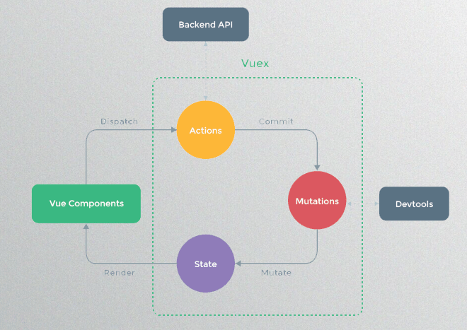

#### vuex

Vuex 是一个专为 Vue.js 应用程序开发的状态管理模式


#### store

创建一个最简单的 store

```
import Vue from "vue";
import Vuex from "vuex";

import home from "./Home";
import todolist from "./TodoList";

Vue.use(Vuex);

export default new Vuex.Store({
  state: {
    text: "全局store"
  },
  mutations: {},
  actions: {},
  modules: { // reducer子模块
    home,
    todolist
  }
});
```

#### Getter 会暴露为 store.getters 对象：

```
getters: {
    getText(state, getters, AllState) {
      console.log(1, state);
      console.log(2, getters);
      console.log(3, AllState); // 所有reducer中的state
      return state.text;
    }
  },
this.$store.getters['todolist/getText']
```

#### Mutation

Vuex 的 store 中的状态的唯一方法是提交 mutation。Vuex 中的 mutation 非常类似于事件：每个 mutation 都有一个字符串的 事件类型 (type) 和 一个 回调函数(handler)。这个回调函数就是我们实际进行状态更改的地方，并且它会接受 state 作为第一个参数，payload 作为第二个参数（额外的参数）：

```
  mutations: {
    addItem(state, data) {
      console.log(data);
      state.todoList.push(data.value);
    },
    deleteItem(state, index) {
      state.todoList.splice(index, 1);
    }
  },
```

ps:mutation 必须是同步函数。

#### Action

Action 类似于 mutation，不同在于：
1.Action 提交的是 mutation，而不是直接变更状态。
2.Action 可以包含任意异步操作。

```
actions: {
    test(context, data) {
      console.log(context);
      context.commit("addItem", data); // 第三个参数{root: true} 可以调用全局的
    }
  }
```

Action 函数接受一个与 store 实例具有相同方法和属性的 context 对象，因此你可以调用 context.commit 提交一个 mutation，或者通过 context.state 和 context.getters 来获取 state 和 getters。

#### vuex api 方法

- mapState 批量取出 state

```
computed: {
    ...mapState({ data: state => state.todolist }),
    data1() {
      return {
        todoList: this.$store.state.todolist.todoList
      };
    }
  },
```

- mapActions 批量取出 action

```
 methods: {
    ...mapActions({
      addItem: "todolist/test"
    }),
    addItemToList(data) {
      this.addItem(data);
      this.inputValue = "";
    },
 }
```
